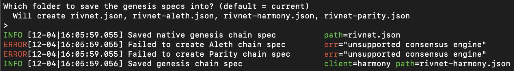
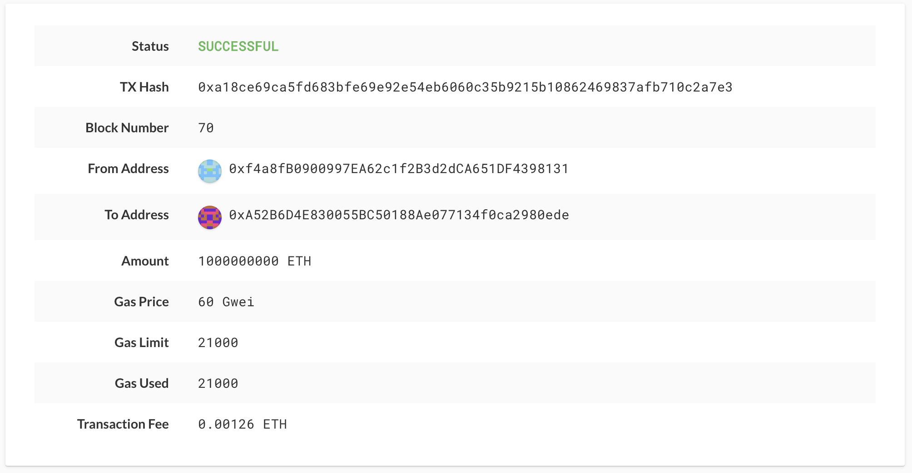

# RivNet: A Local Proof-of-Authority Blockchain

A local proof-of-authority blockchain was decided upon because:
There is no real money involved and testnets allows for offline development.

## Getting Started

These instructions will get you a copy of the project up and running on your local machine for development and testing purposes.

### Prerequisites

For this local blockchain, you will need the following:

```
Geth
MyCrypto
```
Below are instructions on how to install them on your local machine.
### Installing

Installing Geth and tools.

```
Go to https://geth.ethereum.org/downloads/ and install the latest "Geth & Tools" for your operating system.
```

Installing MyCrypto

```
Go to https://download.mycrypto.com/ and install MyCrypto for your operating system.
```

## Set up instructions

1. After installing Geth, move the new directory to your desired directory. Once moved, rename the directory to "blockchains-tools."

2. Next, you will navigate to your new blockchain-tools directory through the command line.

3. In the blockchain-tools directory, you will want to create two node accounts by typing "./geth account new --datadir node1" and "./geth account new --datadir node2" respectively. Set the password for node1 to "121" and node2 to "122". Copy and paste the addresses and passwords into a address.txt and password.txt file, and save into the corresponding node's directory, as they will be needed momentarily.

4. While still in the command line window, type "./puppeth" and navigate through the menu and create a new genesis block with a name of "rivnet", a "Clique (Proof of Authority)" consensus algorithm, and a network ID of "223".

5. You will want to copy and paste both account addresses to seal on the new blockchain. You will also copy and paste both accounts to be pre-funded.

6. Choose "no" for pre-funding pre-compiled accounts.

7. Once you have created your genesis block, and find yourself on the main menu, choose "manage existing genesis" option.

8. From there, click "export genesis configurations". You will only need "rivnet.json", so you can delete "rivnet-harmony.json". You should read the following:



9. Next, you will initialize both nodes with "rivnet.json" using geth.

10. To run the node1, you will type: "./geth --networkid 223 --datadir node1 --syncmode "full" --rpc --unlock "0xf4a8fB0900997EA62c1f2B3d2dCA651DF4398131" --password node1/password.txt --allow-insecure-unlock --mine --minerthreads 1" An explanation of the command line flags follows:

    a. --networkid: Network identifier. Should have been set to "223" when genesis block created.

    b. --datadir: Data directory for the databases and keystore. In this case, node1.

    c. --syncmode: Blockchain sync mode ("fast", "full", or "light") (default: fast).

    d. --rpc: Enable the HTTP-RPC server.

    e. --unlock: Comma separated list of accounts to unlock.

    f. --password: Password file to use for non-interactive password input.

    g. --allow-insecure-unlock: Allow insecure account unlocking when account-related RPCs are expose by http.

    h. --mine: Enable mining.

    j. --minerthreads: Number of CPU threads to use for mining (default: 0).

11. To run node2, you will type: "./geth --networkid 223 --datadir node2 --syncmode "full" --unlock "0xA52B6D4E830055BC50188Ae077134f0ca2980ede" --password node2/password.txt --allow-insecure-unlock --port 30304 --bootnodes "enode://eccbef7d597e4c109c49ebadaf2cd2e0d2c33c481da6f9f4eb60fdf78d13a1132fc6a226397c6a5e10f9cd600dd6e3fbff816ab46d7fa86d37580c3e2400235c@127.0.0.1:30303" --mine --minerthreads 1" An explanation of the command line flags, those different from node1, follows:

    a. --port: Network listening port (default: 30303). Node1 is set to the default, so node2 will be set to port 30304.

    b. --bootnodes: Comma separated node URLs for P2P discovery bootstrap (set v4+v5 instead for light servers)

12. You should now see the two nodes mining blocks!

## Running the tests

## MyCrypto:

14. Open MyCrypto and navigate to the "Change Network" button on the left-hand column.

15. Click on "Add Custom Node" and fill in the fields as follows:

    a. Node Name: RivNet

    b. Network: Custom

    c. Network Name: RivNet

    d. Currency: ETH

    e. Chain ID: 223

    f. URL: http://127.0.0.1:8545

16. Click "Save & Use Custom Node"

17. Click "Keystore File," then "SELECT WALLET FILE," then navigate to the keystone file for node1 in the node1 directory. Input the password you set when creating node1, which should be in the password.txt file in the node1 directory.

18. Put the node2 address in the "To Address" field, select an amount and transaction fee and click "Send Transaction." You should read something similar to the following:



19. Congrats! You have successfully sent a transaction on the RivNet blockchain!

### Break down into end to end tests

Explain what these tests test and why

```
Give an example
```

## Built With

* [Geth](https://geth.ethereum.org/) - Command Line tool used
* [Puppeth](https://github.com/puppeth) - Ethereum Private Network Manager
* [MyCrypto](https://download.mycrypto.com/) - Tool for interacting with the blockchain

## Authors

* **Roberto Cantu**  - [GitHub](https://github.com/RCantu92)